# 🏗️ SMARTFLOW SYSTEMS ARCHITECTURE DIAGRAMS

## System Overview

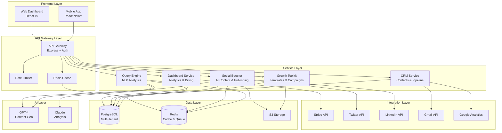

---

## Multi-Tenant Data Isolation

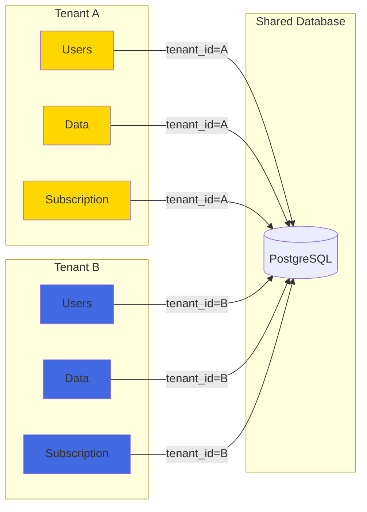

---

## Event-Driven Architecture

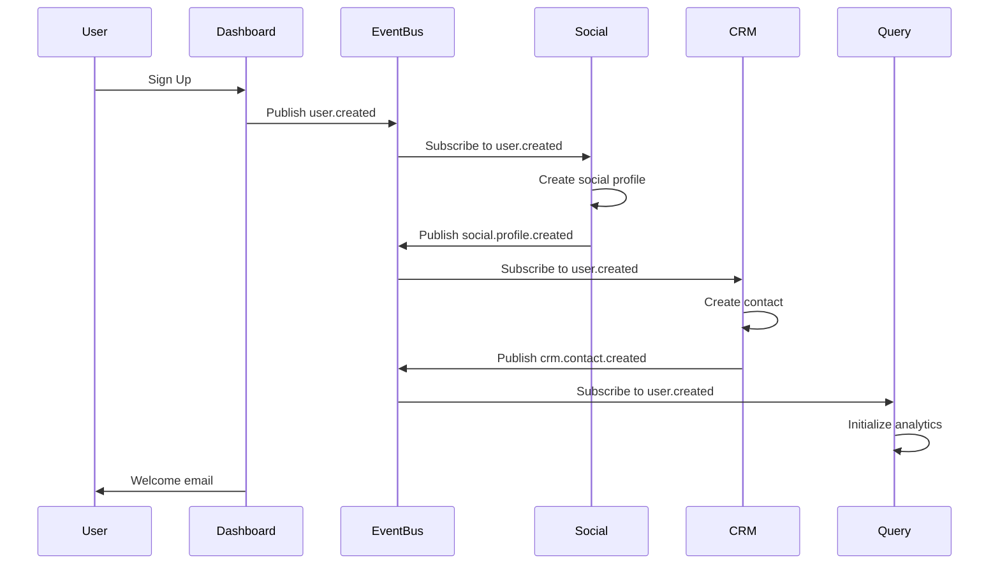

---

## Social Booster Flow

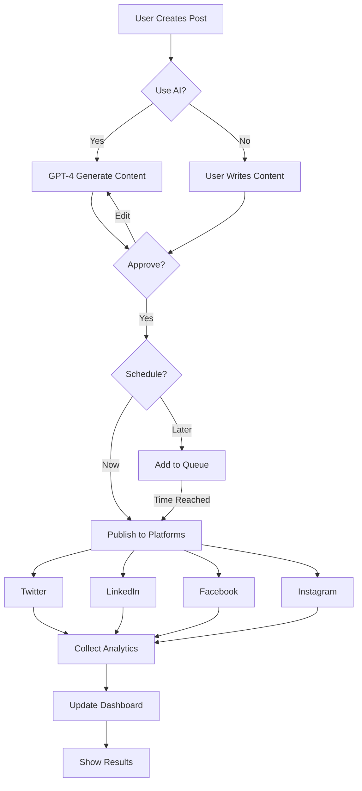

---

## Query Engine Flow

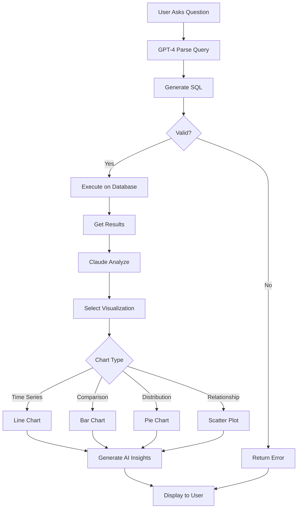

---

## CRM Pipeline Flow

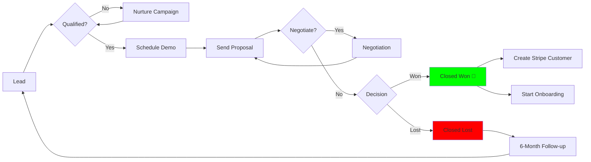

---

## Subscription & Billing Flow

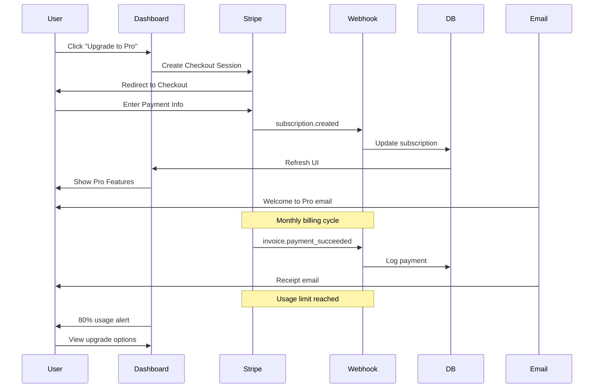

---

## Authentication & Authorization Flow

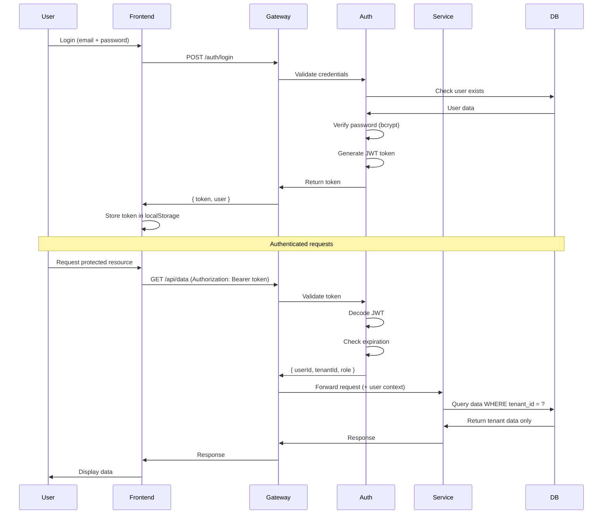

---

## Deployment Architecture

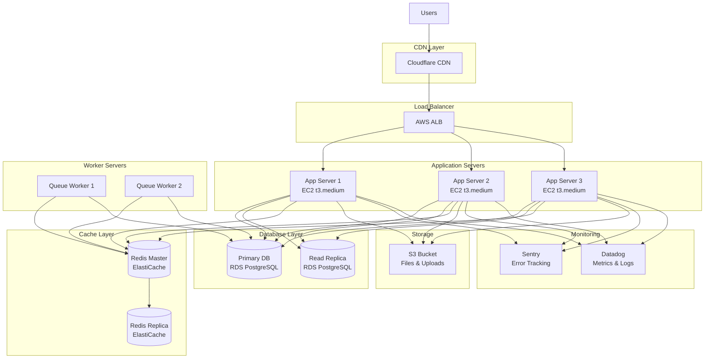

---

## Data Flow: User Journey

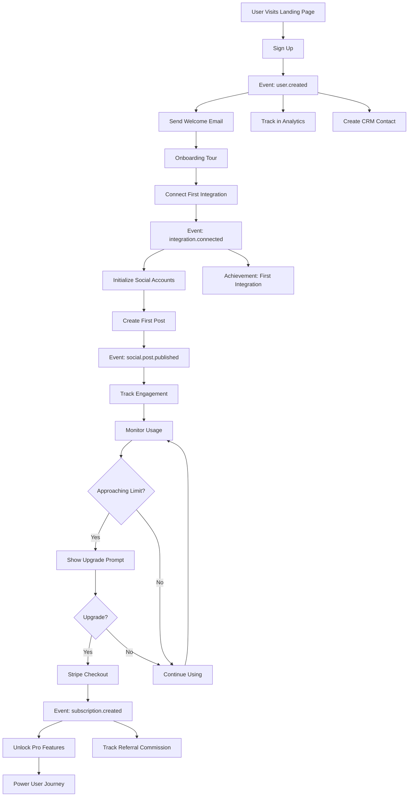

---

## Microservices Communication

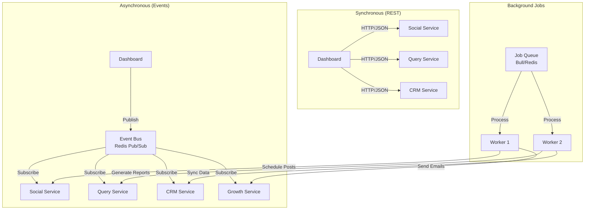

---

## Security Layers

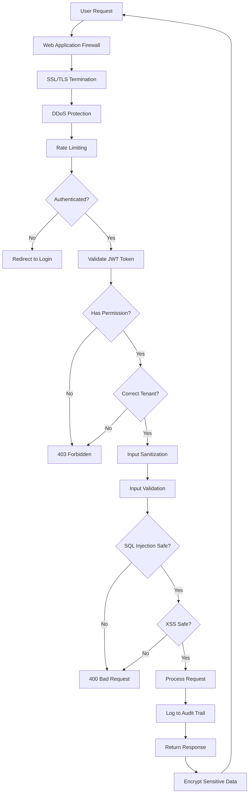

---

## Growth Funnel

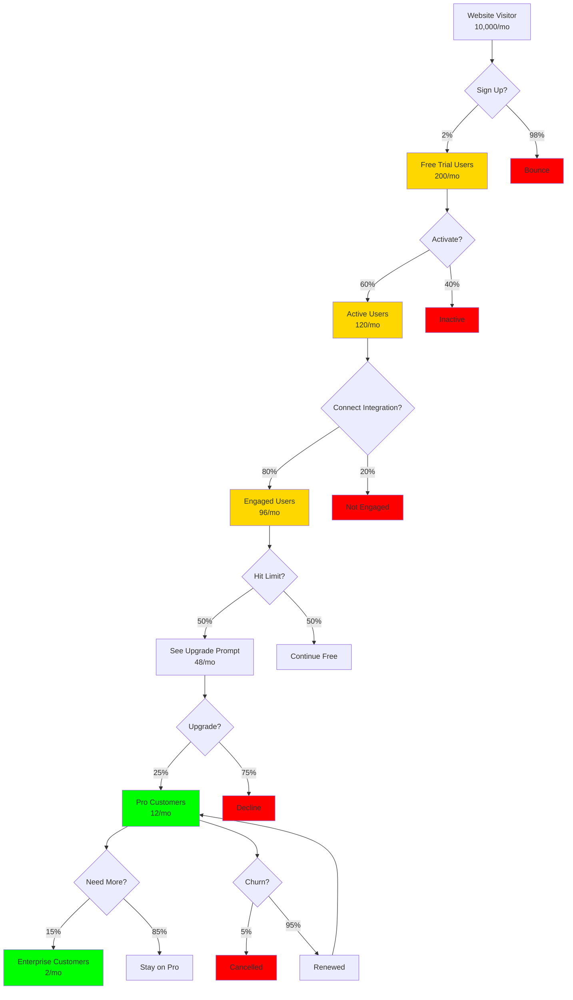

---

## Tech Stack Overview

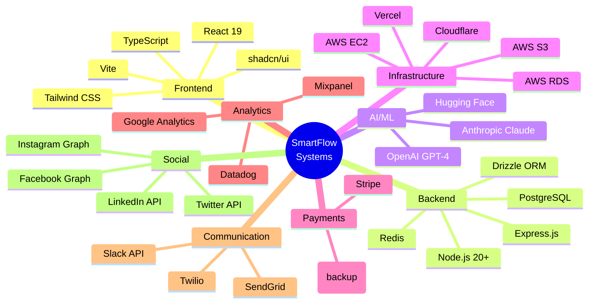

---

## Roadmap Timeline

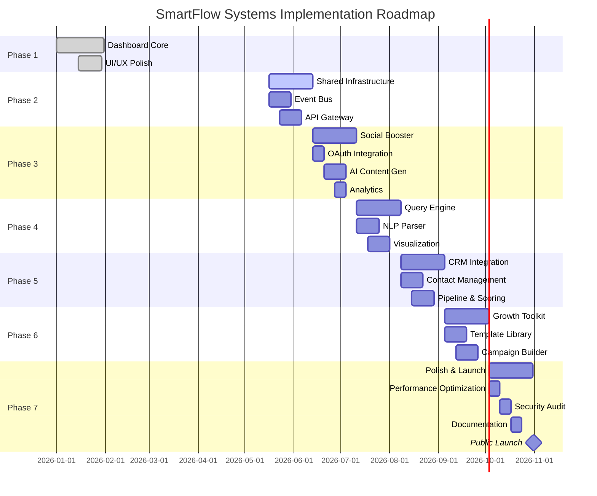

---

## Component Dependencies

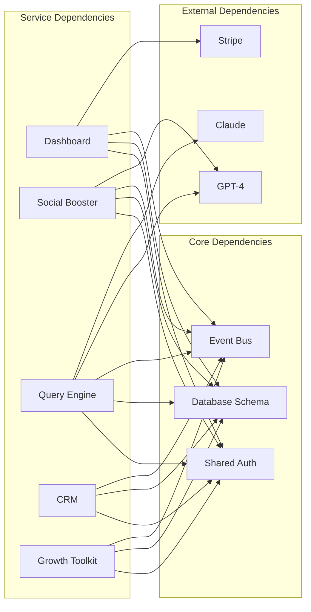

---

## Cost Structure (Per Month)

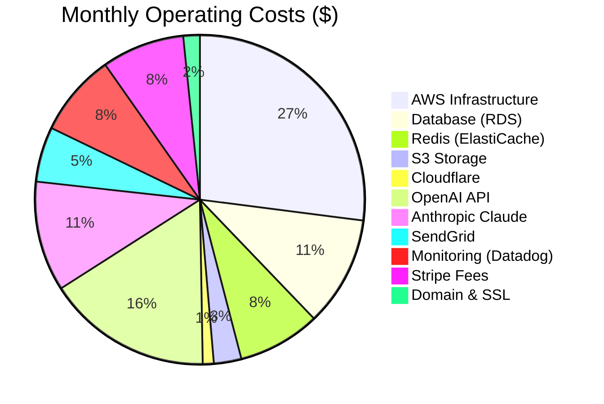

**Total: ~$1,850/month at 100 customers**  
**Break-even: ~48 Pro customers or 10 Enterprise customers**

---

These diagrams visualize the complete SmartFlow Systems architecture, showing how all components work together as one unified ecosystem! 🚀
